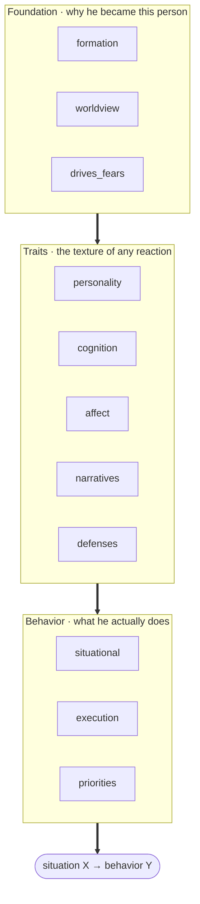

# scapegoat

[中文](README.md) | **English**

> Build a behavior-predictive psychological profile of a specific person, then have Claude think and act as that profile.

## What it does

Turn someone's corpus (chat logs, interviews, documents) or one round of structured questioning into a profile that predicts how they behave. Then:

- **Let them answer** — "reply to this email as my advisor", "what would he make of this proposal?"
- **Let them tear it apart first** — a deliverable gets critiqued by their profile before it reaches the real person
- **Predict what they'd choose** — facing a concrete dilemma, what do they sacrifice and what do they protect?

Output looks like this (from a profile built out of public interviews and posts):

> Under conflict his ordering is: **debt to specific people > integrity of his self-narrative > autonomy > the long-term venture > money > venting**.
> Money sits far down, backed by large real decisions; venting ranks last but is usually already spent before anyone can stop him.

Note the shape: not a label like "he's loyal", but a **ranked conflict-resolution rule** — something you can apply to a situation it was never derived from.

## Why it works

Plenty of setups ask a model to play a person; results vary enormously with how the profile is built. Five constraints do the work here:

**1. The profile is a causal layered model, not a bag of labels.** A label ("he's forceful") predicts nothing; a structure does. The foundation layer explains why this person became who they are, the behavior layer produces the actual predictions — and the two have to line up.

**2. Every insight must reduce to "situation X → behavior Y".** Sentences that cannot name an X and a Y ("he's complicated", "he has his reasons") are barred from the profile. This is what makes a profile falsifiable rather than decorative.

**3. Reversed readings are mandatory.** Every emotionally loaded event is read twice — once literally, once through a less charitable structural lens. Neutralizing is the model's default bias (always reaching for "maybe he had his reasons"), and unless it is actively countered the profile comes out systematically soft.

**4. Stability analysis.** Prediction rests less on "what he is like now" than on "what he will not turn into". Every dimension has to say why that layer will not drift on its own.

**5. A minimal-bytes rule.** Not to save tokens — to prevent dilution. Every sentence has to earn its bytes, or the genuinely predictive rules drown in observations that are true but useless. This one is enforced by a hard budget check.

## How it works

A profile has 11 dimensions. They are not a flat list of labels but a bottom-up chain of explanation:



Lower layers constrain upper ones: what someone protects under conflict (`priorities`) has to trace back to what they fear (`drives_fears`) and the survival strategy they learned early (`formation`). An insight that does not connect is under-evidenced — better to mark low confidence than to invent.

The theory is McAdams' three-level personality model, Mischel's cognitive-affective system (CAPS), and the psychoanalytic view of defenses and life narrative.

End to end:

```
corpus / interview / assessment  →  11-dimension extraction  →  markdown profile  →  freeze  →  persona · adversarial rollout
                                              ↑                                                    │
                                              └──────────  run it again when new data arrives  ←────┘
```

Continuous learning is not a separate mechanism — it is the same entry point run again: new evidence that supports an existing rule adds no words, evidence that sharpens it rewrites the sentence, and evidence that conflicts merges into a conditional rule. **Appending is forbidden** — success means more information at roughly the same byte count.

## How to use it

Two commands inside Claude Code:

```
/plugin marketplace add colehank/scapegoat
/plugin install scapegoat@scapegoat
```

**No Python or other dependencies to install first.** Profile building, persona summoning, and continuous learning are markdown driven; the parts that need a CLI (freeze, rollout, benchmark, budget check) are fetched on demand by [uv](https://docs.astral.sh/uv/)'s `uvx`. It installs to `~/.claude/settings.json` by default (available in every project); put it in a project's `.claude/settings.json` to scope it there.

**No API key for day-to-day use** — adversarial rollout has Claude Code play both roles by default.

Everything else is plain language:

| Goal | What to say |
|---|---|
| Build from corpus | "build a profile of Wang from these chat logs" |
| Build by interview | "help me profile my advisor" (11 dimensions, ~10–15 rounds) |
| Build by assessment | "give me an assessment to build my profile" (~25–35 items, answered by the subject) |
| Summon | "summon Wang", "write an email declining this meeting as Wang" |
| Adversarial polish | "have Wang critique my proposal, run a rollout" |
| Continuous learning | "keep training Wang's profile with this new corpus" |

Profiles land in `profiles/<id>/`: `profile.md` (an index-style overview) plus 11 dimension files under `analyse/`. Dimensions with thin material are marked with their confidence rather than filled in.

<details>
<summary>Local development install</summary>

```bash
git clone git@github.com:colehank/scapegoat.git && cd scapegoat
uv tool install --editable .           # CLI and MCP server
uv tool install --editable ".[audio]"  # optional: speech corpus transcription (pulls PyTorch)
uv tool install --editable ".[claude]" # optional: unattended batch runs

claude --plugin-dir .                  # load the plugin from this directory
```

</details>

## Does it actually work?

Not something to judge by feel. The repo carries a behavior-prediction benchmark: real behavior from **after a cutoff date** is held out, the profile predicts it, and two baselines run alongside — the model's bare prior (name only) and demographic tags. The headline metric is the **profile's gain over the bare prior**, since only that gain is attributable to the profile. Four task types: choice prediction, statement generation, style discrimination, critique alignment.

**Be clear about where it stands: the benchmark is underpowered today.** With 10–15 cases per task and the scoring variance observed, it can only reliably detect effects above ±0.14, while real profile improvements often land in the ±0.05–0.10 range — meaning most directional differences are currently **indistinguishable from noise**. The results are good enough to diagnose what to fix (judge feedback did pinpoint real profile defects) and not good enough to claim performance.

In progress: expanding to 30+ cases per task. Until then, treat the benchmark as a diagnostic under development, not as evidence of quality.

## Privacy and limits

This tool produces psychological analysis of real individuals, usually without their knowledge. Some lines:

- **Data stays local.** `profiles/` and `database/` are in `.gitignore`; do not commit profiles or raw corpus to any repository, least of all a public one.
- **Never put credentials in a profile** (accounts, passwords, addresses). The whole thing gets read into a model context.
- **This is a tool for understanding, not for manipulation.** Reasonable uses are self-understanding, preparing for a conversation, rehearsing a deliverable. Using it to work on a specific person is outside what this project is for.
- **Profiles are wrong sometimes, and confidently so.** The output is inference from limited evidence, not fact. Verify anything that matters.

## Development

```bash
uv sync --group dev
.venv/bin/python -m pytest -q     # 119 tests
just qa                            # format + lint + typecheck + test
```

## License

MIT © 2026 Guohao Zhang
