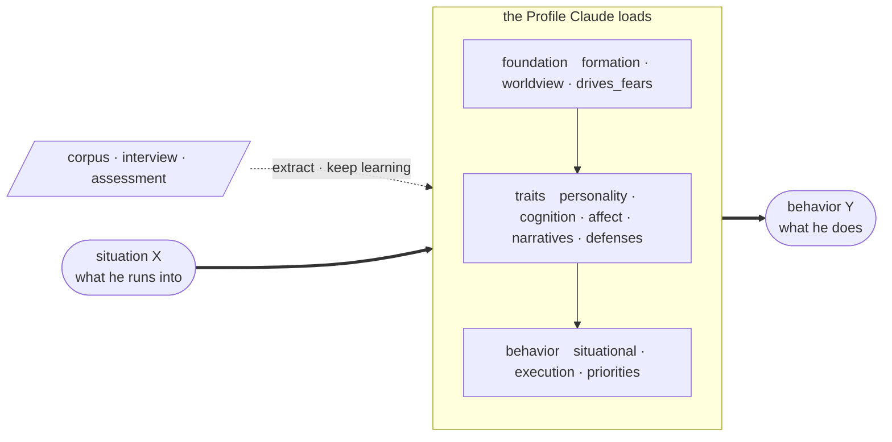

# scapegoat

[中文](README.md) | **English**

> Build a behavior-predictive psychological profile of a specific person, then have Claude think and act as that profile.

## Introduction

Turn someone's corpus (chat logs, interviews, documents) or one round of structured questioning into a profile that predicts how they behave. Then:

- **Let them answer** — "reply to this email as my advisor"
- **Let them tear it apart first** — a deliverable gets critiqued by their profile before it reaches the real person
- **Predict what they'd choose** — facing a concrete dilemma, what do they sacrifice and what do they protect?

Output looks like this (from a profile built out of public material):

> Under conflict his ordering is: **debt to specific people > integrity of his self-narrative > autonomy > the long-term venture > money > venting**. Money sits far down, backed by large real decisions; venting ranks last but is usually already spent before anyone can stop him.

Not a label like "he's loyal", but a **ranked conflict-resolution rule** — something you can apply to a situation it was never derived from.

## Install

Two separate steps inside Claude Code. **Do not paste both lines at once**: the first opens a prompt that wants the repository path and nothing else.

```
/plugin marketplace add AI-innovation-team/scapegoat
```

```
/plugin install scapegoat@scapegoat
```

No Python to install first, and no API key.

## Usage

Three example profiles ship with the plugin (`luoyonghao`, `mentor`, `student`), usable in any directory without building anything first:

> "summon luoyonghao"　　"have mentor critique my proposal"

Everything else is plain language:

| Goal | What to say |
|---|---|
| Build from corpus | "build a profile of Wang from these chat logs" |
| Build by interview | "help me profile my advisor" (11 dimensions, ~10–15 rounds) |
| Build by assessment | "give me an assessment to build my profile" (~25–35 items, answered by the subject) |
| Summon | "summon Wang", "write an email declining this meeting as Wang" |
| Adversarial polish | "have Wang critique my proposal, run a rollout" |
| Continuous learning | "keep training Wang's profile with this new corpus" |

Profiles land in `profiles/<id>/` and take precedence over a bundled one of the same name: `profile.md` as an overview plus 11 dimension files under `analyse/`. Dimensions with thin material carry their confidence rather than invented detail.

<details>
<summary>Local development install</summary>

```bash
git clone https://github.com/AI-innovation-team/scapegoat.git && cd scapegoat
uv tool install --editable .           # CLI and MCP server
uv tool install --editable ".[audio]"  # optional: speech corpus transcription (pulls PyTorch)
uv tool install --editable ".[claude]" # optional: unattended batch runs

claude --plugin-dir .                  # load the plugin from this directory
```

</details>

## Mechanism

A profile is extracted from corpus or questioning, and once Claude loads it, it becomes the thing in the middle — situation in, behavior out:



Inside the profile, the 11 dimensions are not a flat list of labels but a three-layer causal chain: **lower layers constrain upper ones** — what someone protects under conflict (`priorities`) has to trace back to what they fear (`drives_fears`) and the survival strategy they learned early (`formation`). Predictions come off that chain rather than off a guess about "what sort of person he is". The theory is McAdams' three-level personality model, Mischel's cognitive-affective system (CAPS), and the psychoanalytic view of defenses and life narrative.

The dashed arrow is continuous learning: the same entry point run again, where evidence supporting an existing rule adds no words, evidence that sharpens it rewrites the sentence, and conflicting evidence merges into a conditional rule. **Appending is forbidden** — success means more information at roughly the same byte count.

Plenty of setups ask a model to play a person; results vary enormously with how the profile is built. Five constraints do the work:

1. **A layered causal model, not a bag of labels.** A label ("he's forceful") predicts nothing; a structure does. The foundation layer explains why this person became who they are, the behavior layer produces the predictions, and the two have to line up.
2. **Every insight must reduce to "situation X → behavior Y".** Sentences that cannot name an X and a Y ("he's complicated") are barred. This is what makes a profile falsifiable rather than decorative.
3. **Reversed readings are mandatory.** Every emotionally loaded event is read twice — once literally, once through a less charitable structural lens. Neutralizing is the model's default bias; uncountered, the profile comes out systematically soft.
4. **Stability analysis.** Prediction rests less on "what he is like now" than on "what he will not turn into". Every dimension says why that layer will not drift on its own.
5. **A minimal-bytes rule.** Not to save tokens — to prevent dilution. Every sentence has to earn its bytes, or the predictive rules drown in observations that are true but useless. Enforced by a hard budget check.

## Benchmark

The repo carries a behavior-prediction benchmark: real behavior from **after a cutoff date** is held out, the profile predicts it, and two baselines run alongside — the model's bare prior (name only) and demographic tags. The headline metric is the **profile's gain over the bare prior**. Four task types: choice prediction, statement generation, style discrimination, critique alignment.

**This benchmark is still under active construction.** With 10–15 cases per task and the variance observed, it can only reliably detect effects above ±0.14, while real profile improvements often land in the ±0.05–0.10 range — most directional differences cannot yet be told from noise, so the current numbers are good for diagnosing what to fix and not for concluding anything about how well the method works.

Beyond scale, the more important next step is **ablating what a profile is made of**: removing one dimension, one constraint at a time and seeing where predictive power drops. That is how to learn the mechanism — whether it is the layering, the reversed readings, or the byte budget doing the work, and how much each contributes — and what the next round of improvements will be based on.

## Privacy and limits

This tool produces psychological analysis of real individuals, usually without their knowledge.

- **Data stays local.** `profiles/` and `database/` are in `.gitignore`; do not commit profiles or raw corpus to any repository.
- **Never put credentials in a profile** (accounts, passwords, addresses) — the whole thing gets read into a model context.
- **This is a tool for understanding, not for manipulation.** Reasonable uses are self-understanding, preparing for a conversation, rehearsing a deliverable.
- **Profiles are wrong sometimes, and confidently so.** The output is inference from limited evidence, not fact.

## Development

```bash
uv sync --group dev
.venv/bin/python -m pytest -q     # 119 tests
just qa                            # format + lint + typecheck + test
```

MIT © 2026 Guohao Zhang
