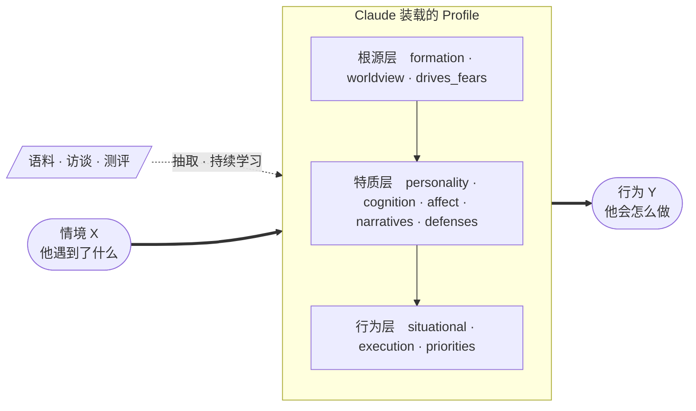

# scapegoat

**中文** | [English](README.en.md)

> 给一个具体的人建立可预测其行为的心理画像，然后让 Claude 以这个画像的身份思考和行动。

## 简介

把一个人的语料（聊天记录、访谈稿、文档）或一轮结构化问答，变成一份能预测他行为的画像。之后可以：

- **让他本人回答** —— 「以我导师的身份回复这封邮件」
- **让他先挑一遍刺** —— 交付物送到真人面前之前，先被他的画像批评几轮
- **预测他会怎么选** —— 面对具体两难，他会牺牲什么保什么

产出长这样（摘自一份由公开语料生成的画像）：

> 冲突时他的排序是：**对具体的人的亏欠 > 自我叙事的完整性 > 自主权 > 长期事业 > 金钱 > 一时之气**。金钱排在很后面，有大额真实决策支撑；"一时之气"排最后，但常常在别人拦住之前就已经支出了。

不是"他很重情义"这类标签，而是一条**带排序的冲突解决规则**——能拿去预测没见过的情境。

## 安装

在 Claude Code 里分两步敲。**不要一次粘贴两行**：第一条会弹出输入框，那里只填仓库地址。

```
/plugin marketplace add AI-innovation-team/ScapeGoat
```

```
/plugin install scapegoat@scapegoat
```

无需预装 Python，也不需要 API key。

## 用法

装完自带三份示例画像（`luoyonghao`、`mentor`、`student`），任何目录都能直接用，不必先建画像：

> 「召唤 luoyonghao」　　「让 mentor 挑刺我的开题报告」

其余全部自然语言触发：

| 想做什么 | 说什么 |
|---|---|
| 从语料建画像 | 「用这些聊天记录给老王建画像」 |
| 访谈建画像 | 「帮我给我导师建画像」（11 维逐维追问，约 10–15 轮） |
| 测评建画像 | 「给我做个测评建画像」（本人作答，约 25–35 题） |
| 附身 | 「召唤老王」「以老王的身份写封邮件推掉这个会」 |
| 对抗打磨 | 「让老王挑刺我的开题报告，跑个 rollout」 |
| 持续学习 | 「用这批新语料继续训练老王的画像」 |

画像产出在 `profiles/<id>/`（同名时优先于内置示例）：`profile.md` 总览 + `analyse/` 下 11 个维度文件。素材不足的维度会标注置信度，不编造。

<details>
<summary>本地开发安装</summary>

```bash
git clone https://github.com/AI-innovation-team/ScapeGoat.git && cd ScapeGoat
uv tool install --editable .           # CLI 与 MCP server
uv tool install --editable ".[audio]"  # 可选：语音语料转写（会拉 PyTorch）
uv tool install --editable ".[claude]" # 可选：脱离会话的自动化跑批

claude --plugin-dir .                  # 以本地目录加载 plugin 调试
```

</details>

## 机制

画像从语料或问答里抽出来，被 Claude 装载后，就成了「情境进、行为出」的那个中间件：



画像内部的 11 个维度不是平列的标签，而是三层因果链：**底层约束上层**——一个人在冲突时保什么（priorities），要能追溯到他怕什么（drives_fears）和他早年学到的生存策略（formation）。预测从这条链上推出来，而不是从"他是个什么样的人"直接猜。理论底子是 McAdams 三层人格模型、Mischel 的认知-情感系统（CAPS）与精神分析的防御/叙事视角。

图里那条虚线是持续学习：同一个入口再跑一次，新证据支持旧规则就不加字，更精确就改写原句，冲突就并成带条件的规则。**禁止纯追加**——信息增加、字节持平才算成功。

同样是让模型扮演一个人，做法不同结果差很远。五条约束在起作用：

1. **分层因果模型，不是标签集合。** 标签（"他很强势"）不能预测，结构能。根源层解释他为什么变成这样，行为层给出预测，两者必须对得上。
2. **每条洞见必须能转成「情境 X → 行为 Y」。** 写不出 X 和 Y 的句子（"他比较复杂"）一律不许进画像。这条决定了画像可证伪还是废话。
3. **强制反转解读。** 每个有情感色彩的事件都走两遍——字面一遍，更不温和的结构性解释再一遍。中性化是模型的默认偏见，不主动对抗画像就会系统性偏软。
4. **稳定性分析。** 预测的基础不是"他现在什么样"，而是"他不会变成什么样"。每个维度都要回答这一层为何不会自然改变。
5. **最小字节原则。** 不为省 token，是防稀释：每句都要挣回自己的字节，否则有预测力的规则会被淹没在正确但无用的描述里。有硬校验，超预算不通过。

## 评测

仓库里有一套行为预测评测：用真人在**特定日期之后**的真实言行做留出集，让画像去预测，对照模型裸先验（只给名字）和人口学标签两个基线；核心指标是**画像相对裸先验的增量**。四类任务：选择预测、言论生成、风格判别、批评对齐。

**这套 benchmark 仍在积极构建中。** 当前每任务 10–15 条 case，在观察到的方差下只能可靠检出 ±0.14 以上的效应，而画像迭代的真实增益常在 ±0.05–0.10 量级——大部分方向性差异还无法与噪声区分，现有数字只够诊断改进方向，不足以支撑对方法效果的结论。

接下来除了扩大规模，更关键的一步是**对画像构成做消融**：逐个维度、逐条约束地拿掉，看预测力掉在哪里。这既是为了搞清楚机制——究竟是分层结构、反转解读还是最小字节在起作用、各自贡献多少——也是继续优化方法的依据。

## 隐私与边界

这个工具会生成关于真实个人的心理分析，多数情况下对方并不知情。

- **数据留在本地。** `profiles/`、`database/` 已在 `.gitignore` 中；不要把画像或原始语料提交到任何仓库。
- **画像里不要写凭证类信息**（账号、密码、住址），它会被完整读进模型上下文。
- **这是理解工具，不是操控工具。** 合理用途是自我认知、沟通准备、交付物预演。
- **画像会犯错，而且错得很自信。** 输出是基于有限证据的推断，不是事实。

## 开发

```bash
uv sync --group dev
.venv/bin/python -m pytest -q     # 119 tests
just qa                            # format + lint + typecheck + test
```

MIT © 2026 Guohao Zhang
