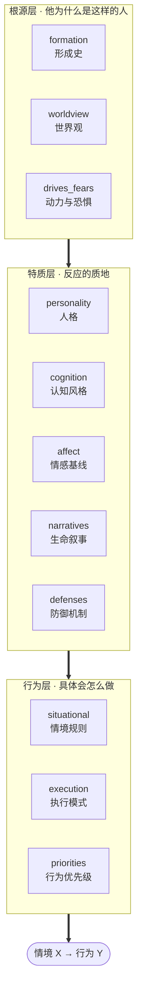

# scapegoat

**中文** | [English](README.en.md)

> 给一个具体的人建立可预测其行为的心理画像，然后让 Claude 以这个画像的身份思考和行动。

## 能干什么

把一个人的语料（聊天记录、访谈稿、文档）或一轮结构化问答，变成一份能预测他行为的画像。之后可以：

- **让他本人回答** —— 「以我导师的身份回复这封邮件」「他看到这个方案会怎么想」
- **让他先挑一遍刺** —— 交付物在送到真人面前之前，先被他的画像批评几轮
- **预测他会怎么选** —— 面对具体两难，他会牺牲什么保什么

产出长这样（摘自一份由公开访谈与微博语料生成的画像）：

> 冲突时他的排序是：**对具体的人的亏欠 > 自我叙事的完整性 > 自主权 > 长期事业 > 金钱 > 一时之气**。
> 金钱排在很后面，有大额真实决策支撑；"一时之气"排最后，但常常在别人拦住之前就已经支出了。

注意它的形式：不是"他很重情义"这类标签，而是一个**带排序的冲突解决规则**——能拿去预测没见过的情境。

## 为什么能干

同样是让模型扮演一个人，做法不同结果差很远。这套方法的关键约束有五条：

**1. 画像是因果分层模型，不是标签集合。** 标签（"他很强势"）不能预测，结构能。根源层解释这个人为什么变成这样，行为层才给出具体预测——两者必须能对得上。

**2. 每条洞见必须能转成「情境 X → 行为 Y」。** 写不出 X 和 Y 的句子（"他比较复杂""他有自己的难处"）一律不许进画像。这条决定了画像是可证伪的还是废话。

**3. 强制反转解读。** 每个有情感色彩的事件都要走两遍——字面解释一遍，更不温和的结构性解释再来一遍。中性化是模型的默认偏见（总倾向于"也许他有苦衷"），必须主动对抗，否则画像会系统性地偏软。

**4. 稳定性分析。** 预测的基础不是"他现在什么样"，而是"他不会变成什么样"。每个维度都要回答这一层为何不会自然改变。

**5. 最小字节原则。** 不是为省 token，是防稀释：每句都要挣回自己的字节，否则真正有预测力的规则会被淹没在正确但无用的描述里。这条有硬校验（超预算不通过）。

## 怎么干的

画像由 11 个维度构成，它们不是平列的标签，而是一套自下而上的解释链：



底层约束上层：一个人在冲突时保什么（priorities），要能追溯到他怕什么（drives_fears）和他早年学到的生存策略（formation）。对不上的洞见说明证据不足，宁可标注置信度也不编。

理论底子是 McAdams 三层人格模型、Mischel 的认知-情感系统（CAPS），以及精神分析的防御与叙事视角。

整条链路：

```
语料 / 问答 / 测评  →  11 维抽取  →  markdown 画像  →  freeze  →  附身 · 对抗迭代
                            ↑                                    │
                            └────────  新数据来了再跑一遍  ←──────┘
```

持续学习不是另一套机制，就是同一个入口再跑一次：新证据支持旧规则就不加字，更精确就改写原句，冲突就并成带条件的规则。**禁止纯追加**——信息增加、字节持平才算成功。

## 怎么用

在 Claude Code 里两条命令：

```
/plugin marketplace add colehank/scapegoat
/plugin install scapegoat@scapegoat
```

**不需要预先装 Python 或任何依赖。** 建画像、附身、持续学习是纯 markdown 驱动；需要 CLI 的部分（freeze、rollout、benchmark、字节预算校验）由 [uv](https://docs.astral.sh/uv/) 的 `uvx` 按需拉起。默认装在 `~/.claude/settings.json`（所有项目可用），也可写进项目的 `.claude/settings.json` 只在本项目启用。

**日常使用不需要 API key**——对抗迭代默认由 Claude Code 自己扮演双方角色。

之后全部用自然语言触发：

| 想做什么 | 说什么 |
|---|---|
| 从语料建画像 | 「用这些聊天记录给老王建画像」 |
| 访谈建画像 | 「帮我给我导师建画像」（11 维逐维追问，约 10–15 轮） |
| 测评建画像 | 「给我做个测评建画像」（本人作答，约 25–35 题） |
| 附身 | 「召唤老王」「以老王的身份写封邮件推掉这个会」 |
| 对抗打磨 | 「让老王挑刺我的开题报告，跑个 rollout」 |
| 持续学习 | 「用这批新语料继续训练老王的画像」 |

画像产出在 `profiles/<id>/`：`profile.md`（索引式总览）+ `analyse/` 下 11 个维度文件。素材不足的维度会如实标注置信度，不编造。

<details>
<summary>本地开发安装</summary>

```bash
git clone git@github.com:colehank/scapegoat.git && cd scapegoat
uv tool install --editable .           # CLI 与 MCP server
uv tool install --editable ".[audio]"  # 可选：语音语料转写（会拉 PyTorch）
uv tool install --editable ".[claude]" # 可选：脱离会话的自动化跑批

claude --plugin-dir .                  # 以本地目录加载 plugin 调试
```

</details>

## 效果验证

画像准不准，不能靠感觉。仓库里有一套行为预测评测：用真人在**特定日期之后**的真实言行做留出集，让画像去预测，并对照两个基线——模型的裸先验（只给名字）和人口学标签。核心指标是**画像相对裸先验的增量**，只有这个增量才是画像本身的贡献。四类任务：选择预测、言论生成、风格判别、批评对齐。

**现状要说清楚：这套评测目前样本量不足。** 每任务 10–15 条 case，在观察到的评分方差下只能可靠检出 ±0.14 以上的效应，而画像迭代的真实增益常在 ±0.05–0.10 量级——也就是说，大部分方向性差异目前**无法与噪声区分**。已有的结果只够用来诊断改进方向（judge 给出的失败线索确实精准定位了画像缺陷），不足以支撑"效果好"的结论。

正在做的：把 case 扩到每任务 30 条以上。在那之前，请把评测当成开发中的诊断工具，而不是性能背书。

## 隐私与边界

这个工具会生成关于真实个人的心理分析，多数情况下对方并不知情。几条底线：

- **数据留在本地。** `profiles/`、`database/` 已在 `.gitignore` 中；不要把画像或原始语料提交到任何仓库，尤其是公开仓库。
- **画像里不要写凭证类信息**（账号、密码、住址）。它会被完整读进模型上下文。
- **这是理解工具，不是操控工具。** 合理用途是自我认知、沟通准备、交付物预演；用它去针对具体个人施加影响，超出了本项目的意图。
- **画像会犯错，而且错得很自信。** 它输出的是基于有限证据的推断，不是事实。重要判断请自己复核。

## 开发

```bash
uv sync --group dev
.venv/bin/python -m pytest -q     # 119 tests
just qa                            # format + lint + typecheck + test
```

## License

MIT © 2026 Guohao Zhang
