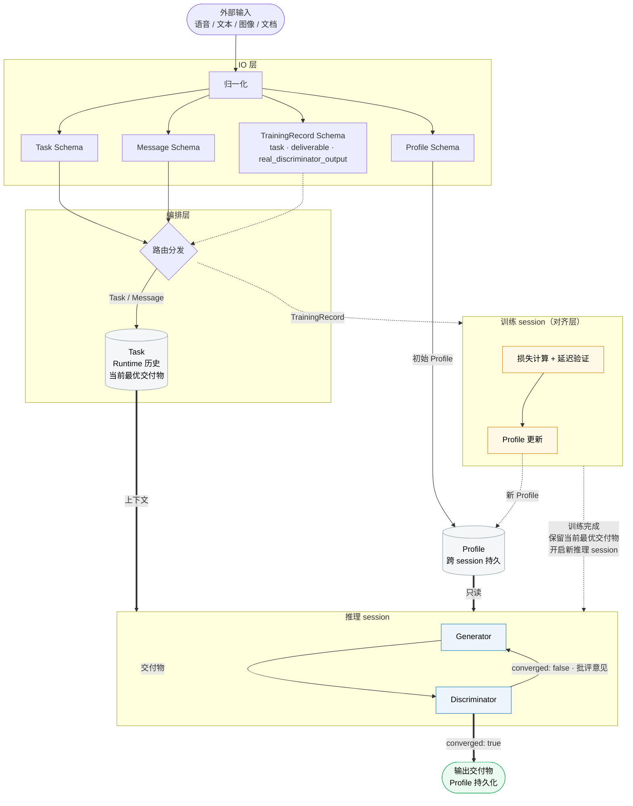

```mermaid
flowchart TD
    classDef infer  fill:#EBF5FB,stroke:#2980B9,color:#000
    classDef train  fill:#FEF9E7,stroke:#D68910,color:#000
    classDef store  fill:#F4F6F7,stroke:#95A5A6,color:#000
    classDef output fill:#EAFAF1,stroke:#27AE60,color:#000

    IN([外部输入\n语音 / 文本 / 图像 / 文档])

    %% ── IO 层 ──────────────────────────────────────
    subgraph IO["IO 层"]
        NORM[归一化]
        T_SCH[Task Schema]
        M_SCH[Message Schema]
        P_SCH[Profile Schema]
        TR_SCH[TrainingRecord Schema\ntask · deliverable · real_discriminator_output]
        NORM --> T_SCH & M_SCH & P_SCH & TR_SCH
    end

    %% ── 编排层 ──────────────────────────────────────
    subgraph ORCH["编排层"]
        ROUTE{路由分发}
        STATE[(Task\nRuntime 历史\n当前最优交付物)]:::store
        ROUTE -->|Task / Message| STATE
    end

    PROF[(Profile\n跨 session 持久)]:::store

    %% ── 推理 session ────────────────────────────────
    subgraph INF["推理 session"]
        G[Generator]:::infer
        D[Discriminator]:::infer
        G -->|交付物| D
        D -->|"converged: false · 批评意见"| G
    end

    %% ── 训练 session ────────────────────────────────
    subgraph TRN["训练 session（对齐层）"]
        LOSS[损失计算 + 延迟验证]:::train
        UPD[Profile 更新]:::train
        LOSS --> UPD
    end

    OUT([输出交付物\nProfile 持久化]):::output

    %% ── 数据入口 ────────────────────────────────────
    IN --> NORM
    P_SCH -->|初始 Profile| PROF
    T_SCH & M_SCH --> ROUTE

    %% ── 推理路径（粗实线 · 蓝）────────────────────────
    STATE   ==>|上下文| INF
    PROF    ==>|只读| INF
    D       ==>|converged: true| OUT

    %% ── 训练路径（虚线 · 橙）─────────────────────────
    TR_SCH  -.-> ROUTE
    ROUTE   -.->|TrainingRecord| TRN
    UPD     -.->|新 Profile| PROF
    TRN     -.->|训练完成\n保留当前最优交付物\n开启新推理 session| INF
```
